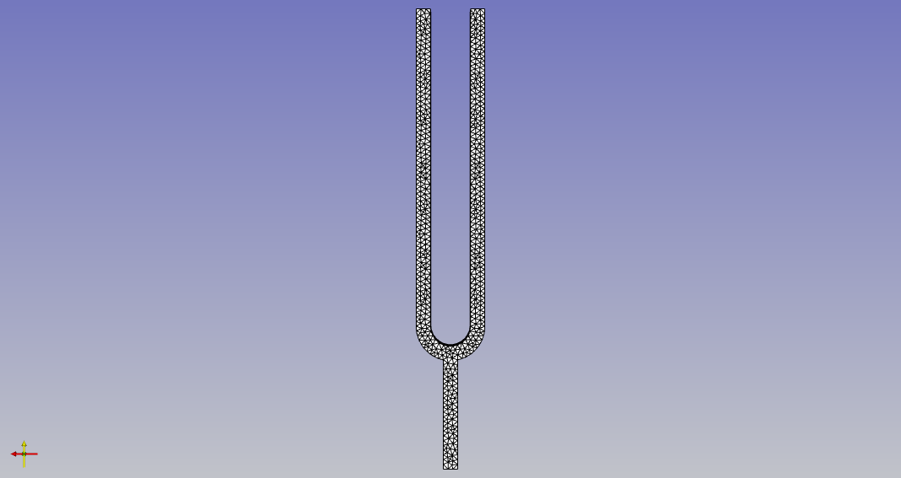

# Tuning fork benchmark

<a href="https://blogtechniczny.pl/paraview-glance/index.html?name=fork.vtk&url=https://blogtechniczny.pl/para-files/fork.vtk" target="_blank"></a>


[](https://blogtechniczny.pl/paraview-glance/index.html?name=fork.vtk&url=https://blogtechniczny.pl/para-files/fork.vtk)

```{tip}
Click on the image above to play with 3D object in ParaView Glance!
```

## Model definition

The aim of this study is to compare the results from a modal analysis performed in [CalculiX](http://www.calculix.de/), [Code_Aster](https://code-aster.org/) and [Elmer](http://www.elmerfem.org/blog/) Finite-Element codes. A tuning fork geometry will be used to measure the software performance. The model described in this report was created on a basis of the article found in this [link](http://pubs.sciepub.com/ajme/4/7/16/index.html).

```{figure} ./fork-geo-results.png
---
width: 400px
alt: Fork original Results
name: Fork Results
---
Tuning fork geometry and its' vibration modes
```

## Approximated solution

It is possible to estimate the frequency of the fork using the fixed-free cantilever beam equation.

$$
   \begin{eqnarray}
      f_{1} = \frac{1.875^{2}}{2 \pi L^{2}} \sqrt{\frac{E I}{\rho A}} = 495.11 [Hz]
   \end{eqnarray}
$$

- Length of the prong, $L=0.0709$ [m]
- Young's modulus, $E=207$ [GPa]
- Material density, $\rho = 7829 $ [kg/$m^{3}$]
- Moment of inertia $I = \frac{a^{4}}{12}$ [$m^{4}$]
- Cross-sectional area of the prong, $A = a^{2}$

Based on the expected value of frequency $f=440$ Hz, the relative error can be measured as follows:

$$
   \begin{eqnarray}
      Error = \frac{495.11 - 440.0}{440} \cdot 100 \% = 12.5 \%
   \end{eqnarray}
$$

## Material properties

The table below presents all the material properties that were used in the study. These properties aim to reproduce the behaviour of steel material.

| Property              | Value                | Unit       |
|-----------------------|----------------------|------------|
| Density $\rho$        | $7829.0$             | kg/$m^{3}$ |
| Young's modulus, E    | $2.07 \cdot 10^{11}$ | Pa         |
| Poissons ratio, $\nu$ | 0.33                 | -          |


